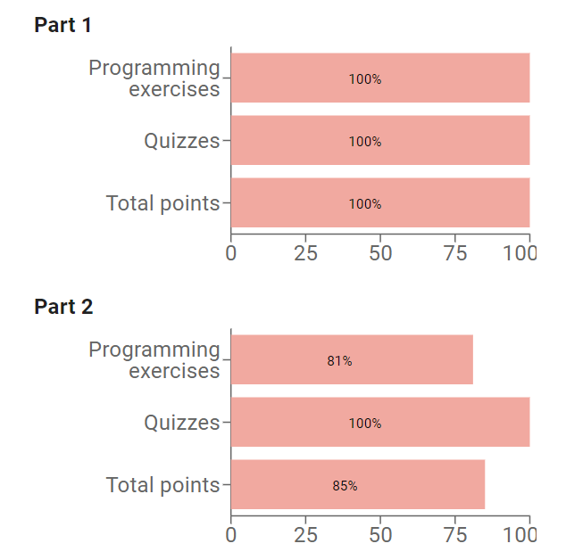
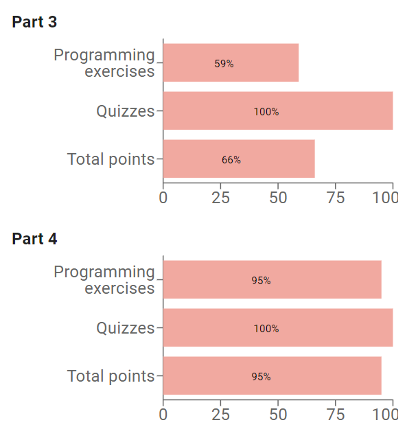
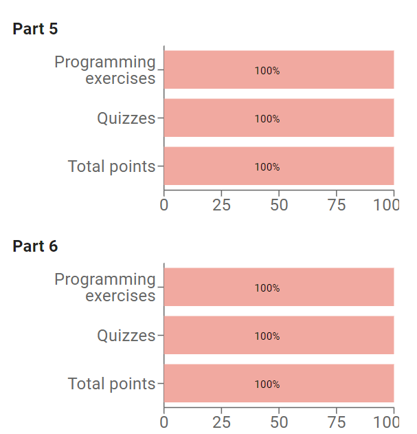
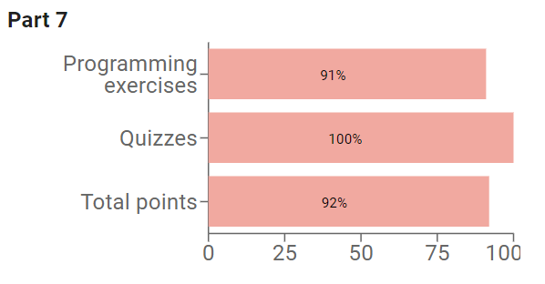

# mooc-java-programming-1part 

This java mooc course part 1 was really crucial in my understandig of core JAVA and helped me to stand on my feet in JAVA world

[Java and NetBeans installation guide needed for this course](https://www.mooc.fi/en/installation/netbeans)

---

## Topics covered in the part 1 course:
- **part1:** Printing, Reading input, Variables, Calculating with numbers, Conditional statements and conditional operation
- **part2:** Recurring problems and patterns to solve them, Repeating functionality, loops, Methods and dividing the program into smaller parts
- **part3:** Discovering errors, Lists, Arrays, Using Strings
- **part4:** Introduction to object-oriented programming, Objects in a lists, Reading and writing data
- **part5:** More OOP, Removing repetitive code, Primitive and reference variables, Objects and references
- **part6:** Objects on a list and a list as part of an object, Separating the user interface from program logic, Introduction to testing
- **part7:** Programming paradigms, Algorithms, Larger programming exercises

---

## IDE: [NeatBeans](https://netbeans.apache.org/) [TMC](https://tmc.mooc.fi/)

## Progress:
  

 
